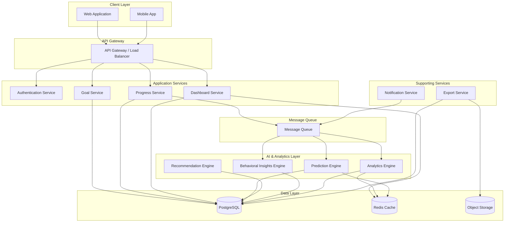

# Design Document: MomentumAI Platform

## Overview

MomentumAI is an AI-powered goal tracking and motivation platform built on a modular, scalable architecture. The system consists of a frontend web application, RESTful API backend, AI prediction engine, analytics processing pipeline, and notification service. The platform uses machine learning to analyze user behavior patterns, predict goal completion likelihood, and generate personalized recommendations.

The architecture follows a microservices pattern with clear separation between presentation, business logic, AI processing, and data persistence layers. This design enables independent scaling of compute-intensive AI operations while maintaining responsive user interactions.

## Architecture

### High-Level Architecture



### Scalability Architecture

**Horizontal Scaling Strategy:**

The platform is designed for horizontal scalability across all layers:

**1. Application Services Layer**
- Stateless microservices deployed in containers (Docker/Kubernetes)
- Auto-scaling based on CPU/memory utilization and request queue depth
- Load balancer distributes requests using round-robin with health checks
- Each service can scale independently based on demand
- Target: 3-10 instances per service under normal load, up to 50 during peak

**2. AI & Analytics Layer**
- Compute-intensive operations run as background workers
- Worker pool scales based on message queue depth
- GPU-accelerated instances for ML model inference (optional)
- Batch processing for non-real-time analytics
- Target: 5-20 worker instances, scaling to 100+ during batch jobs

**3. Data Layer Scaling**

**PostgreSQL:**
- Primary-replica configuration with read replicas
- Write operations go to primary, reads distributed across replicas
- Connection pooling (PgBouncer) to handle 1000+ concurrent connections
- Partitioning strategy:
  - Goals table: Partitioned by userId (hash partitioning)
  - ProgressEntry table: Partitioned by timestamp (range partitioning, monthly)
  - Predictions table: Partitioned by timestamp (range partitioning, weekly)
- Automated vacuum and index maintenance
- Target: 1 primary + 3-5 read replicas

**Redis:**
- Redis Cluster mode for horizontal scaling
- Separate clusters for different use cases:
  - Session cache (high availability, persistence disabled)
  - Analytics cache (larger memory, persistence enabled)
  - Prediction cache (TTL-based eviction)
- Target: 3-6 node cluster per use case

**Message Queue:**
- Distributed message broker (RabbitMQ cluster or AWS SQS)
- Multiple queues for different priorities:
  - High priority: Real-time predictions, critical notifications
  - Normal priority: Analytics updates, recommendations
  - Low priority: Batch exports, historical analysis
- Dead letter queues for failed message handling
- Target: 3-5 broker nodes in cluster

**4. Caching Strategy**

**Multi-Level Caching:**
- L1: Application-level in-memory cache (per instance)
- L2: Distributed Redis cache (shared across instances)
- L3: CDN for static assets and API responses (optional)

**Cache Invalidation:**
- Event-driven invalidation via message queue
- TTL-based expiration as fallback
- Cache-aside pattern for most operations
- Write-through for critical data

**Cache Keys and TTLs:**
- User dashboard: `dashboard:{userId}` - 5 minutes
- Goal details: `goal:{goalId}` - 15 minutes
- Analytics: `analytics:{userId}:{period}` - 1 hour
- Predictions: `prediction:{goalId}` - 24 hours
- User session: `session:{token}` - 1 hour

**5. Database Optimization**

**Indexing Strategy:**
```sql
-- Goals table
CREATE INDEX idx_goals_user_status ON goals(userId, status);
CREATE INDEX idx_goals_target_date ON goals(targetDate) WHERE status = 'active';
CREATE INDEX idx_goals_category ON goals(category);

-- ProgressEntry table
CREATE INDEX idx_progress_goal_timestamp ON progress_entries(goalId, timestamp DESC);
CREATE INDEX idx_progress_user_timestamp ON progress_entries(userId, timestamp DESC);

-- Predictions table
CREATE INDEX idx_predictions_goal ON predictions(goalId, generatedAt DESC);
CREATE INDEX idx_predictions_risk ON predictions(riskLevel, generatedAt) WHERE riskLevel = 'high';
```

**Query Optimization:**
- Use EXPLAIN ANALYZE for all complex queries
- Implement query result caching for expensive aggregations
- Use materialized views for pre-computed analytics
- Batch insert operations for progress entries
- Use prepared statements to prevent SQL injection and improve performance

**6. Asynchronous Processing**

**Event-Driven Architecture:**
- Progress updates trigger async events for AI processing
- Decouples user-facing operations from compute-intensive tasks
- Ensures fast API response times (< 500ms)

**Event Types:**
```
ProgressUpdated: { goalId, userId, newProgress, timestamp }
GoalCompleted: { goalId, userId, completionTime }
GoalCreated: { goalId, userId, goalData }
PredictionGenerated: { goalId, prediction, riskLevel }
PatternDetected: { userId, patternType, data }
```

**7. Load Balancing**

**API Gateway Configuration:**
- Health check endpoint: `/health` (200 OK if service healthy)
- Circuit breaker: Open after 5 consecutive failures, half-open after 30s
- Request timeout: 30 seconds
- Rate limiting: 100 requests/minute per user, 1000/minute per IP
- Sticky sessions: Not required (stateless services)

**Load Distribution:**
- Round-robin for uniform request distribution
- Least connections for long-running operations
- IP hash for WebSocket connections (real-time updates)

**8. Monitoring and Auto-Scaling**

**Scaling Triggers:**
- Scale up when: CPU > 70% for 5 minutes OR queue depth > 100
- Scale down when: CPU < 30% for 15 minutes AND queue depth < 10
- Min instances: 2 per service (high availability)
- Max instances: 50 per service (cost control)

**Health Checks:**
- Liveness probe: Service responds to HTTP requests
- Readiness probe: Service can handle traffic (DB connected, cache available)
- Startup probe: Service initialization complete

**9. Geographic Distribution**

**Multi-Region Deployment (Future):**
- Primary region: US-East (main user base)
- Secondary region: EU-West (GDPR compliance, lower latency)
- Read replicas in each region
- Cross-region replication for disaster recovery
- GeoDNS routing based on user location

**10. Performance Targets**

**Response Time SLAs:**
- API endpoints: p95 < 500ms, p99 < 1s
- Dashboard load: p95 < 300ms
- Prediction generation: < 2s
- Analytics calculation: < 3s
- Report generation: < 10s

**Throughput Targets:**
- 1000 concurrent users (normal load)
- 10,000 concurrent users (peak load)
- 100 requests/second per service instance
- 1000 messages/second through queue

**Availability Target:**
- 99.9% uptime (< 8.76 hours downtime per year)
- Zero data loss for committed transactions
- < 1 minute recovery time for service failures

### Deployment Architecture

The MomentumAI platform is designed for containerized deployment with orchestration, enabling consistent environments across development, staging, and production. The deployment strategy emphasizes automation, resilience, and zero-downtime updates.

**Container Strategy:**

**1. Containerization (Docker)**
- Each microservice packaged as a Docker container
- Multi-stage builds to minimize image size (< 200MB per service)
- Base images: Alpine Linux for minimal attack surface
- Container registry: Private registry (AWS ECR, Google Container Registry, or Azure ACR)
- Image tagging strategy: semantic versioning + git commit SHA
- Vulnerability scanning on every image build using Trivy or Snyk

**Service Containers:**
```
momentum-ai/auth-service:1.2.3-a1b2c3d
momentum-ai/goal-service:1.2.3-a1b2c3d
momentum-ai/progress-service:1.2.3-a1b2c3d
momentum-ai/dashboard-service:1.2.3-a1b2c3d
momentum-ai/prediction-engine:1.2.3-a1b2c3d
momentum-ai/recommendation-engine:1.2.3-a1b2c3d
momentum-ai/insights-engine:1.2.3-a1b2c3d
momentum-ai/analytics-engine:1.2.3-a1b2c3d
momentum-ai/notification-service:1.2.3-a1b2c3d
momentum-ai/export-service:1.2.3-a1b2c3d
```

**2. Orchestration (Kubernetes)**

**Cluster Architecture:**
- Production cluster: 3 master nodes (HA control plane), 10-50 worker nodes
- Staging cluster: 1 master node, 3-5 worker nodes
- Development cluster: Single-node Minikube or kind for local development

**Namespace Organization:**
```
momentum-ai-prod/
  ├── application-services/    (user-facing services)
  ├── ai-services/             (ML and analytics)
  ├── infrastructure/          (monitoring, logging)
  └── data/                    (stateful services)
```

**Deployment Manifests:**
- Deployments: Define desired state for each service
- Services: Internal load balancing and service discovery
- Ingress: External traffic routing with TLS termination
- ConfigMaps: Environment-specific configuration
- Secrets: Sensitive data (API keys, database credentials)
- HorizontalPodAutoscaler: Auto-scaling rules
- PodDisruptionBudget: Maintain availability during updates

**Example Deployment Configuration:**
```yaml
apiVersion: apps/v1
kind: Deployment
metadata:
  name: goal-service
  namespace: application-services
spec:
  replicas: 3
  strategy:
    type: RollingUpdate
    rollingUpdate:
      maxSurge: 1
      maxUnavailable: 0
  selector:
    matchLabels:
      app: goal-service
  template:
    spec:
      containers:
      - name: goal-service
        image: momentum-ai/goal-service:1.2.3
        resources:
          requests:
            cpu: 200m
            memory: 256Mi
          limits:
            cpu: 500m
            memory: 512Mi
        livenessProbe:
          httpGet:
            path: /health
            port: 8080
          initialDelaySeconds: 30
          periodSeconds: 10
        readinessProbe:
          httpGet:
            path: /ready
            port: 8080
          initialDelaySeconds: 10
          periodSeconds: 5
```

**3. Service Orchestration**

**Service Mesh (Optional - Istio or Linkerd):**
- Automatic service-to-service encryption (mTLS)
- Traffic management (canary deployments, A/B testing)
- Observability (distributed tracing, metrics)
- Circuit breaking and retry policies
- Rate limiting at service level

**Service Discovery:**
- Kubernetes DNS for internal service resolution
- Service names resolve to cluster IPs
- Example: `goal-service.application-services.svc.cluster.local`
- External DNS for public endpoints

**4. Load Balancing**

**External Load Balancer:**
- Cloud provider load balancer (AWS ALB, GCP Load Balancer, Azure Load Balancer)
- SSL/TLS termination at load balancer
- Health checks every 10 seconds
- Connection draining: 30 seconds during updates
- Sticky sessions: Not required (stateless services)

**Internal Load Balancing:**
- Kubernetes Service provides L4 load balancing
- Distributes traffic across healthy pods
- Automatic removal of unhealthy pods from rotation
- Session affinity: None (stateless design)

**Load Balancer Configuration:**
```
Protocol: HTTPS (443)
Backend Protocol: HTTP (8080)
Health Check: GET /health every 10s
Timeout: 30s
Idle Timeout: 60s
Connection Draining: 30s
```

**5. Database Deployment**

**Cloud-Managed Databases (Recommended):**

**PostgreSQL:**
- AWS RDS PostgreSQL, Google Cloud SQL, or Azure Database for PostgreSQL
- Multi-AZ deployment for high availability
- Automated backups: Daily snapshots, 7-day retention
- Point-in-time recovery: 5-minute granularity
- Automated minor version upgrades during maintenance window
- Read replicas: 3-5 replicas in same region
- Connection pooling: PgBouncer deployed as sidecar containers

**Configuration:**
```
Instance Type: db.r5.xlarge (4 vCPU, 32GB RAM)
Storage: 500GB SSD with auto-scaling to 2TB
Backup Window: 02:00-03:00 UTC
Maintenance Window: Sunday 03:00-04:00 UTC
Encryption: AES-256 at rest
```

**Redis:**
- AWS ElastiCache, Google Memorystore, or Azure Cache for Redis
- Redis Cluster mode for horizontal scaling
- Multi-AZ with automatic failover
- Backup: Daily snapshots for persistence-enabled clusters
- Eviction policy: allkeys-lru for cache clusters

**Configuration:**
```
Node Type: cache.r5.large (2 vCPU, 13GB RAM)
Cluster: 3 shards, 1 replica per shard (6 nodes total)
Backup Window: 03:00-04:00 UTC
Encryption: In-transit and at-rest
```

**6. Message Queue Deployment**

**Managed Message Queue:**
- AWS SQS/SNS, Google Cloud Pub/Sub, or Azure Service Bus
- Fully managed, no infrastructure maintenance
- Automatic scaling and high availability
- Dead letter queues for failed messages

**Self-Hosted Alternative (RabbitMQ):**
- Deployed as StatefulSet in Kubernetes
- 3-node cluster for high availability
- Persistent volumes for message durability
- Management UI for monitoring

**7. Object Storage**

**Cloud Object Storage:**
- AWS S3, Google Cloud Storage, or Azure Blob Storage
- Bucket organization:
  - `momentum-ai-exports/`: User data exports
  - `momentum-ai-backups/`: Database backups
  - `momentum-ai-logs/`: Archived logs
- Lifecycle policies: Delete exports after 7 days
- Versioning enabled for backups
- Server-side encryption (SSE-S3 or SSE-KMS)

**8. Deployment Pipeline**

**CI/CD Workflow (GitHub Actions, GitLab CI, or Jenkins):**

```
1. Code Push → Git Repository
2. Trigger CI Pipeline
   ├── Run linters and formatters
   ├── Run unit tests
   ├── Run property-based tests
   ├── Run integration tests
   └── Security scan (SAST)
3. Build Docker Images
   ├── Multi-stage build
   ├── Tag with version and commit SHA
   └── Push to container registry
4. Deploy to Staging
   ├── Update Kubernetes manifests
   ├── Apply with kubectl or Helm
   ├── Wait for rollout completion
   └── Run E2E tests
5. Manual Approval Gate
6. Deploy to Production
   ├── Blue-green or canary deployment
   ├── Monitor error rates and latency
   ├── Automatic rollback on failure
   └── Complete rollout
```

**Deployment Strategies:**

**Rolling Update (Default):**
- Update pods gradually (1 at a time)
- Zero downtime
- Automatic rollback on health check failure
- Duration: 5-10 minutes for full rollout

**Blue-Green Deployment:**
- Deploy new version alongside old version
- Switch traffic after validation
- Instant rollback capability
- Higher resource usage (2x during deployment)

**Canary Deployment:**
- Route 10% traffic to new version
- Monitor metrics for 15 minutes
- Gradually increase to 50%, then 100%
- Automatic rollback if error rate increases

**9. Infrastructure as Code**

**Terraform for Cloud Resources:**
- VPC, subnets, security groups
- Load balancers
- Managed databases (RDS, ElastiCache)
- Object storage buckets
- IAM roles and policies

**Helm Charts for Kubernetes:**
- Package all Kubernetes manifests
- Parameterized configurations for environments
- Version-controlled releases
- Easy rollback to previous versions

**10. Monitoring and Observability**

**Metrics Collection:**
- Prometheus for metrics scraping
- Grafana for visualization
- Pre-built dashboards for each service
- Custom alerts for SLA violations

**Logging:**
- Centralized logging with ELK stack (Elasticsearch, Logstash, Kibana)
- Or cloud-native: AWS CloudWatch, Google Cloud Logging, Azure Monitor
- Structured JSON logs
- Log retention: 30 days hot, 90 days cold storage

**Distributed Tracing:**
- Jaeger or Zipkin for request tracing
- Trace every API request through all services
- Identify performance bottlenecks
- Correlate logs with traces

**11. Disaster Recovery**

**Backup Strategy:**
- Database: Automated daily snapshots, 7-day retention
- Configuration: Git repository (version controlled)
- Secrets: Encrypted backup in secure storage
- Object storage: Cross-region replication

**Recovery Procedures:**
- RTO (Recovery Time Objective): 1 hour
- RPO (Recovery Point Objective): 5 minutes
- Automated failover for database
- Manual failover for application services
- Documented runbooks for disaster scenarios

**12. Cost Optimization**

**Resource Right-Sizing:**
- Monitor actual resource usage
- Adjust CPU/memory requests and limits
- Use spot instances for non-critical workloads
- Scale down non-production environments during off-hours

**Reserved Capacity:**
- Purchase reserved instances for baseline load (30-50% savings)
- Use on-demand for burst capacity
- Commit to 1-year or 3-year terms for maximum savings

### Enterprise Reliability Architecture

The MomentumAI platform implements enterprise-grade reliability through comprehensive failover mechanisms, redundancy at every layer, and robust disaster recovery capabilities. The architecture targets 99.95% availability with automated recovery from common failure scenarios.

**1. High Availability Design Principles**

**Eliminate Single Points of Failure:**
- Every component deployed with redundancy (minimum 2 instances)
- Multi-AZ deployment for all critical services
- Active-active configuration where possible, active-passive for stateful components
- Geographic distribution for disaster recovery

**Fault Isolation:**
- Failure in one service doesn't cascade to others
- Circuit breaker pattern prevents retry storms
- Bulkhead pattern isolates resource pools
- Graceful degradation when dependencies fail

**Automated Recovery:**
- Self-healing infrastructure with health checks
- Automatic pod restart on failure (Kubernetes liveness probes)
- Automatic traffic rerouting away from unhealthy instances
- Automated failover for databases and caches

**2. Application Layer Redundancy**

**Microservice Redundancy:**
- Minimum 3 replicas per service in production
- Replicas distributed across availability zones
- Anti-affinity rules prevent co-location on same node
- Rolling updates ensure continuous availability

**Pod Distribution Strategy:**
```yaml
affinity:
  podAntiAffinity:
    requiredDuringSchedulingIgnoredDuringExecution:
    - labelSelector:
        matchExpressions:
        - key: app
          operator: In
          values:
          - goal-service
      topologyKey: kubernetes.io/hostname
  nodeAffinity:
    preferredDuringSchedulingIgnoredDuringExecution:
    - weight: 100
      preference:
        matchExpressions:
        - key: topology.kubernetes.io/zone
          operator: In
          values:
          - us-east-1a
          - us-east-1b
          - us-east-1c
```

**Service Health Checks:**
- Liveness probe: Detects crashed/deadlocked services (restart trigger)
- Readiness probe: Detects services unable to handle traffic (remove from load balancer)
- Startup probe: Allows slow-starting services time to initialize

**Health Check Configuration:**
```yaml
livenessProbe:
  httpGet:
    path: /health/live
    port: 8080
  initialDelaySeconds: 30
  periodSeconds: 10
  timeoutSeconds: 5
  failureThreshold: 3

readinessProbe:
  httpGet:
    path: /health/ready
    port: 8080
  initialDelaySeconds: 10
  periodSeconds: 5
  timeoutSeconds: 3
  failureThreshold: 2
  successThreshold: 1
```

**Circuit Breaker Implementation:**
- Open circuit after 5 consecutive failures
- Half-open state after 30 seconds (test with single request)
- Close circuit after 3 consecutive successes
- Fail fast when circuit open (return cached data or error)
- Per-dependency circuit breakers (database, cache, external APIs)

**3. Data Layer Redundancy**

**PostgreSQL High Availability:**

**Primary-Replica Configuration:**
- 1 primary instance (write operations)
- 3-5 read replicas (read operations)
- Synchronous replication to 1 replica (zero data loss)
- Asynchronous replication to remaining replicas (performance)
- Automatic failover using cloud provider managed service

**Failover Mechanism:**
```
Detection: Health check fails on primary (30 seconds)
  ↓
Promotion: Synchronous replica promoted to primary (60 seconds)
  ↓
DNS Update: Connection endpoint updated to new primary (30 seconds)
  ↓
Replication: Remaining replicas reconnect to new primary (automatic)
  ↓
Total Failover Time: ~2 minutes
```

**Connection Pooling with Failover:**
- PgBouncer connection pooler (deployed as sidecar)
- Pool size: 100 connections per service instance
- Automatic retry on connection failure
- Connection timeout: 10 seconds
- Query timeout: 30 seconds

**Database Backup Strategy:**
- Automated daily full backups at 02:00 UTC
- Continuous WAL (Write-Ahead Log) archiving every 5 minutes
- Point-in-time recovery capability (5-minute granularity)
- Backup retention: 7 days online, 30 days archived
- Cross-region backup replication for disaster recovery
- Monthly backup restoration tests

**Redis High Availability:**

**Redis Cluster Configuration:**
- 3 master nodes (sharded data)
- 1 replica per master (6 nodes total)
- Automatic failover via Redis Sentinel or cloud provider
- Cluster mode for horizontal scaling
- Separate clusters for different use cases (session, cache, queue)

**Failover Behavior:**
```
Master Failure Detection: Sentinel quorum (3 sentinels agree)
  ↓
Replica Promotion: Replica promoted to master (< 10 seconds)
  ↓
Client Notification: Clients receive cluster topology update
  ↓
Reconnection: Clients reconnect to new master (automatic)
  ↓
Total Failover Time: < 30 seconds
```

**Cache Resilience:**
- Cache failures don't cause service outages
- Fallback to database on cache miss
- Circuit breaker prevents cache stampede
- Graceful degradation: Serve stale data if cache unavailable
- Cache warming on startup to prevent cold start issues

**4. Message Queue Redundancy**

**RabbitMQ Cluster (Self-Hosted Option):**
- 3-node cluster with mirrored queues
- Quorum queues for critical messages (Raft consensus)
- Automatic leader election on node failure
- Persistent messages survive node restarts
- Dead letter queues for failed message handling

**Managed Queue Service (Cloud Option):**
- AWS SQS: Fully managed, infinite scaling
- Message retention: 14 days
- At-least-once delivery guarantee
- Visibility timeout: 30 seconds (message processing time)
- Dead letter queue after 3 failed attempts

**Message Processing Resilience:**
- Idempotent message handlers (safe to process multiple times)
- Message deduplication using unique message IDs
- Exponential backoff for retries (1s, 2s, 4s, 8s, 16s)
- Poison message detection (move to DLQ after 5 attempts)
- Manual intervention queue for unprocessable messages

**5. Load Balancer Redundancy**

**Multi-AZ Load Balancer:**
- Cloud provider managed load balancer (AWS ALB, GCP LB)
- Deployed across 3 availability zones
- Automatic failover between zones
- Health checks every 10 seconds
- Unhealthy target removal within 30 seconds

**Load Balancer Configuration:**
```
Cross-Zone Load Balancing: Enabled
Connection Draining: 30 seconds
Idle Timeout: 60 seconds
Deregistration Delay: 30 seconds
Health Check:
  - Protocol: HTTP
  - Path: /health
  - Interval: 10 seconds
  - Timeout: 5 seconds
  - Healthy Threshold: 2
  - Unhealthy Threshold: 3
```

**DNS Failover:**
- Route53 health checks on load balancer endpoints
- Automatic DNS failover to secondary region (if configured)
- TTL: 60 seconds for fast failover
- Latency-based routing for multi-region deployments

**6. Network Redundancy**

**Multi-AZ Networking:**
- VPC spans multiple availability zones
- Subnets in each AZ (public, private, data)
- NAT gateways in each AZ for outbound traffic
- VPN connections with redundant tunnels

**Network Topology:**
```
Region: us-east-1
├── AZ: us-east-1a
│   ├── Public Subnet: 10.0.1.0/24
│   ├── Private Subnet: 10.0.11.0/24
│   └── Data Subnet: 10.0.21.0/24
├── AZ: us-east-1b
│   ├── Public Subnet: 10.0.2.0/24
│   ├── Private Subnet: 10.0.12.0/24
│   └── Data Subnet: 10.0.22.0/24
└── AZ: us-east-1c
    ├── Public Subnet: 10.0.3.0/24
    ├── Private Subnet: 10.0.13.0/24
    └── Data Subnet: 10.0.23.0/24
```

**7. Disaster Recovery Strategy**

**Recovery Objectives:**
- RTO (Recovery Time Objective): 1 hour
- RPO (Recovery Point Objective): 5 minutes
- Data Loss Tolerance: Maximum 5 minutes of data
- Service Restoration Priority: Auth → Goal → Progress → Dashboard → AI

**Disaster Scenarios and Recovery:**

**Scenario 1: Single Service Failure**
- Detection: Health check failure, monitoring alerts
- Recovery: Automatic pod restart by Kubernetes
- Time: < 1 minute
- Impact: No user impact (load balancer routes to healthy instances)

**Scenario 2: Availability Zone Failure**
- Detection: Multiple service failures in same AZ
- Recovery: Traffic automatically routed to other AZs
- Time: < 5 minutes
- Impact: Possible brief latency increase, no data loss

**Scenario 3: Database Primary Failure**
- Detection: Database health check failure
- Recovery: Automatic promotion of synchronous replica
- Time: 2-3 minutes
- Impact: Brief read-only mode during failover

**Scenario 4: Complete Region Failure**
- Detection: All services unreachable in primary region
- Recovery: Manual failover to secondary region (if configured)
- Time: 30-60 minutes
- Impact: Service outage during failover, up to 5 minutes data loss

**Scenario 5: Data Corruption**
- Detection: Data validation checks, user reports
- Recovery: Point-in-time restore from backup
- Time: 1-4 hours (depending on data size)
- Impact: Rollback to last known good state

**8. Backup and Restore Procedures**

**Backup Strategy:**

**Database Backups:**
- Full backup: Daily at 02:00 UTC
- Incremental backup: WAL archiving every 5 minutes
- Backup storage: S3 with versioning enabled
- Backup encryption: AES-256
- Cross-region replication: Async to secondary region
- Backup validation: Weekly automated restore test

**Application State Backups:**
- Kubernetes manifests: Git repository (version controlled)
- ConfigMaps and Secrets: Encrypted backup to S3 daily
- Helm chart values: Git repository
- Infrastructure as Code: Terraform state in S3 with versioning

**Redis Backups:**
- RDB snapshots: Daily at 03:00 UTC
- AOF (Append-Only File): Continuous for critical data
- Backup retention: 7 days
- Backup storage: S3

**Restore Procedures:**

**Database Restore:**
```
1. Identify restore point (timestamp or backup ID)
2. Create new database instance from backup
3. Apply WAL logs up to desired point-in-time
4. Validate data integrity (row counts, checksums)
5. Update application connection strings
6. Perform smoke tests
7. Switch traffic to restored database
8. Monitor for issues
Total Time: 1-2 hours
```

**Full System Restore:**
```
1. Provision infrastructure using Terraform
2. Deploy Kubernetes cluster
3. Restore database from backup
4. Restore Redis from snapshot
5. Deploy application services using Helm
6. Restore configuration from Git
7. Validate all services healthy
8. Update DNS to new environment
9. Perform end-to-end testing
Total Time: 2-4 hours
```

**9. Chaos Engineering and Resilience Testing**

**Chaos Testing Strategy:**
- Monthly chaos engineering exercises
- Simulate random pod failures (kill random pods)
- Simulate AZ failures (block network traffic)
- Simulate database failover (force primary shutdown)
- Simulate cache failures (stop Redis cluster)
- Simulate network latency and packet loss

**Chaos Testing Tools:**
- Chaos Mesh for Kubernetes chaos experiments
- AWS Fault Injection Simulator for cloud-level failures
- Gremlin for comprehensive chaos testing

**Test Scenarios:**
```
Test 1: Random Pod Termination
  - Kill 1 random pod every 5 minutes
  - Verify: No user-facing errors, automatic recovery

Test 2: AZ Failure Simulation
  - Block all traffic to/from one AZ
  - Verify: Traffic routes to other AZs, < 1s latency spike

Test 3: Database Failover
  - Force primary database shutdown
  - Verify: Automatic failover, < 3 min downtime

Test 4: Cache Cluster Failure
  - Stop all Redis nodes
  - Verify: Graceful degradation, fallback to database

Test 5: Message Queue Failure
  - Stop message broker
  - Verify: Messages queued locally, retry on recovery
```

**10. Monitoring and Alerting for Reliability**

**Reliability Metrics:**
- Service uptime percentage (per service)
- Mean Time Between Failures (MTBF)
- Mean Time To Recovery (MTTR)
- Error rate (errors per 1000 requests)
- Latency percentiles (p50, p95, p99)
- Availability SLA compliance

**Critical Alerts:**
```
P0 - Critical (Immediate Response):
  - Service completely unavailable
  - Database primary failure
  - Data corruption detected
  - Security breach detected

P1 - High (15 minute response):
  - Service degraded (error rate > 5%)
  - Database replica failure
  - Cache cluster failure
  - Backup failure

P2 - Medium (1 hour response):
  - High latency (p95 > 2s)
  - Disk usage > 80%
  - Memory usage > 85%
  - Certificate expiring in 7 days

P3 - Low (Next business day):
  - Non-critical service warnings
  - Performance degradation
  - Capacity planning alerts
```

**Alerting Channels:**
- PagerDuty for P0/P1 alerts (24/7 on-call)
- Slack for P2/P3 alerts
- Email for daily summary reports
- SMS for critical alerts (P0 only)

**11. Runbooks and Incident Response**

**Incident Response Process:**
```
1. Detection (Automated monitoring or user report)
   ↓
2. Triage (Assess severity, assign priority)
   ↓
3. Notification (Alert on-call engineer via PagerDuty)
   ↓
4. Investigation (Review logs, metrics, traces)
   ↓
5. Mitigation (Apply fix or workaround)
   ↓
6. Verification (Confirm issue resolved)
   ↓
7. Communication (Update status page, notify users)
   ↓
8. Post-Mortem (Root cause analysis, action items)
```

**Standard Runbooks:**

**Runbook 1: Service Unresponsive**
```
Symptoms: Health checks failing, 503 errors
Investigation:
  - Check pod status: kubectl get pods -n <namespace>
  - Check logs: kubectl logs <pod-name>
  - Check resource usage: kubectl top pods
Resolution:
  - Restart pod: kubectl delete pod <pod-name>
  - Scale up: kubectl scale deployment <name> --replicas=5
  - Rollback: helm rollback <release> <revision>
```

**Runbook 2: Database Connection Failures**
```
Symptoms: Connection timeout errors, high latency
Investigation:
  - Check database status in cloud console
  - Check connection pool metrics
  - Check for long-running queries
Resolution:
  - Restart connection pooler
  - Kill long-running queries
  - Scale up database instance
  - Failover to replica if primary unhealthy
```

**Runbook 3: High Error Rate**
```
Symptoms: Error rate > 5%, user complaints
Investigation:
  - Check error logs for patterns
  - Check recent deployments
  - Check external dependencies
Resolution:
  - Rollback recent deployment if correlated
  - Enable circuit breaker for failing dependency
  - Scale up if resource constrained
```

**12. Business Continuity Planning**

**Critical Business Functions:**
1. User authentication (Priority 1)
2. Goal creation and viewing (Priority 1)
3. Progress logging (Priority 1)
4. Dashboard viewing (Priority 2)
5. AI predictions (Priority 3)
6. Recommendations (Priority 3)
7. Notifications (Priority 3)
8. Reports and exports (Priority 4)

**Degraded Mode Operations:**
- If AI services fail: Serve cached predictions, disable new predictions
- If cache fails: Serve from database (slower but functional)
- If message queue fails: Process synchronously (slower but functional)
- If notification service fails: Queue notifications for later delivery
- If export service fails: Disable exports temporarily

**Communication Plan:**
- Status page: status.momentumai.com (hosted separately)
- Twitter: @MomentumAIStatus for real-time updates
- Email: Notify affected users for major incidents
- In-app banner: Display service status warnings

**13. Compliance and Audit Requirements**

**Audit Trail:**
- All infrastructure changes logged (Terraform, kubectl)
- All configuration changes logged (Git commits)
- All database schema changes logged (migration history)
- All access to production systems logged (SSH, kubectl)
- Logs immutable and tamper-proof (write-once storage)

**Compliance Certifications (Future):**
- SOC 2 Type II (Security, Availability, Confidentiality)
- ISO 27001 (Information Security Management)
- HIPAA (if handling health data)
- PCI DSS (if handling payment data)

**Regular Audits:**
- Quarterly security audits
- Annual disaster recovery drill
- Monthly backup restoration tests
- Weekly vulnerability scans

### Security Architecture

Security is implemented at every layer of the MomentumAI platform, following defense-in-depth principles. The architecture incorporates industry best practices for authentication, authorization, data protection, and threat mitigation.

**1. Transport Security**

**HTTPS Everywhere:**
- All external communication uses TLS 1.3 (minimum TLS 1.2)
- Strong cipher suites only (AES-256-GCM, ChaCha20-Poly1305)
- Perfect Forward Secrecy (PFS) enabled
- HSTS (HTTP Strict Transport Security) header enforced
- Certificate management: Automated renewal via Let's Encrypt or AWS ACM
- Certificate pinning for mobile apps

**TLS Configuration:**
```
Protocols: TLSv1.3, TLSv1.2
Cipher Suites: 
  - TLS_AES_256_GCM_SHA384
  - TLS_CHACHA20_POLY1305_SHA256
  - TLS_AES_128_GCM_SHA256
HSTS: max-age=31536000; includeSubDomains; preload
```

**Internal Service Communication:**
- Service-to-service: mTLS (mutual TLS) via service mesh
- Database connections: SSL/TLS required
- Redis connections: TLS enabled
- Message queue: TLS for all connections

**2. Authentication and Authorization**

**JWT-Based Authentication:**

**Token Structure:**
```json
{
  "header": {
    "alg": "RS256",
    "typ": "JWT"
  },
  "payload": {
    "sub": "user-id-123",
    "email": "user@example.com",
    "roles": ["user"],
    "iat": 1234567890,
    "exp": 1234571490,
    "jti": "token-id-456"
  }
}
```

**Token Management:**
- Access token lifetime: 1 hour
- Refresh token lifetime: 30 days
- Refresh token rotation: New refresh token issued on each refresh
- Token revocation: Blacklist stored in Redis with TTL
- Signing algorithm: RS256 (RSA with SHA-256)
- Key rotation: Every 90 days

**Password Security:**
- Hashing algorithm: bcrypt with cost factor 12
- Minimum password length: 12 characters
- Password complexity: Require uppercase, lowercase, number, special character
- Password history: Prevent reuse of last 5 passwords
- Account lockout: 5 failed attempts, 15-minute lockout
- Password reset: Time-limited tokens (1 hour expiration)

**Multi-Factor Authentication (MFA):**
- TOTP (Time-based One-Time Password) support
- Backup codes for account recovery
- MFA required for sensitive operations (account deletion, email change)

**3. Role-Based Access Control (RBAC)**

**Role Definitions:**

**User Role:**
- Create, read, update, delete own goals
- View own progress and analytics
- Generate own reports
- Update own profile and preferences

**Admin Role:**
- All user permissions
- View aggregate analytics across all users (anonymized)
- Manage system configuration
- Access audit logs
- Perform user account operations (disable, delete)

**System Role:**
- Internal service-to-service communication
- Background job execution
- No user-facing access

**Permission Enforcement:**
- Every API endpoint checks user permissions
- Resource ownership validation (user can only access own data)
- Principle of least privilege
- Permissions cached in Redis for performance

**4. Data Encryption**

**Encryption at Rest:**

**Database Encryption:**
- PostgreSQL: Transparent Data Encryption (TDE) using AES-256
- Encryption managed by cloud provider (AWS RDS encryption, etc.)
- Encrypted backups and snapshots
- Encrypted transaction logs

**Redis Encryption:**
- Encryption at rest enabled for persistence
- Encrypted snapshots

**Object Storage Encryption:**
- Server-side encryption (SSE-S3 or SSE-KMS)
- Encryption key rotation every 90 days
- Client-side encryption for highly sensitive exports (optional)

**Application-Level Encryption:**
- Sensitive fields encrypted before storage (optional for PII)
- Encryption library: AES-256-GCM
- Key management: AWS KMS, Google Cloud KMS, or Azure Key Vault
- Envelope encryption: Data encrypted with data key, data key encrypted with master key

**Encryption in Transit:**
- All network communication encrypted (TLS/mTLS)
- No plaintext transmission of sensitive data
- Encrypted message queue payloads for sensitive events

**5. Input Validation and Sanitization**

**API Input Validation:**
- Schema validation for all request bodies (JSON Schema)
- Type checking and range validation
- String length limits enforced
- Whitelist approach for allowed characters
- Reject requests with unexpected fields

**SQL Injection Prevention:**
- Parameterized queries exclusively (no string concatenation)
- ORM usage (SQLAlchemy, TypeORM) with proper escaping
- Least privilege database users (no DROP, ALTER permissions)
- Input validation before database operations

**XSS Prevention:**
- Output encoding for all user-generated content
- Content Security Policy (CSP) headers
- Sanitize HTML input (if rich text supported)
- Use framework-provided escaping (React, Vue auto-escaping)

**Command Injection Prevention:**
- Avoid shell command execution with user input
- If necessary, use allowlist validation
- Use language-native APIs instead of shell commands

**6. Rate Limiting and DDoS Protection**

**API Rate Limiting:**

**Per-User Limits:**
- 100 requests per minute per authenticated user
- 1000 requests per hour per authenticated user
- Separate limits for expensive operations (exports: 5/hour)

**Per-IP Limits:**
- 1000 requests per minute per IP (unauthenticated)
- 10,000 requests per hour per IP

**Implementation:**
- Token bucket algorithm
- Rate limit state stored in Redis
- HTTP 429 response with Retry-After header
- Exponential backoff recommended to clients

**DDoS Protection:**
- Cloud provider DDoS protection (AWS Shield, Cloudflare)
- Web Application Firewall (WAF) rules
- Geographic blocking for suspicious regions (optional)
- Automatic IP blacklisting for attack patterns

**7. Security Headers**

**HTTP Security Headers:**
```
Strict-Transport-Security: max-age=31536000; includeSubDomains; preload
Content-Security-Policy: default-src 'self'; script-src 'self'; style-src 'self' 'unsafe-inline'
X-Content-Type-Options: nosniff
X-Frame-Options: DENY
X-XSS-Protection: 1; mode=block
Referrer-Policy: strict-origin-when-cross-origin
Permissions-Policy: geolocation=(), microphone=(), camera=()
```

**8. Secrets Management**

**Secret Storage:**
- Never commit secrets to version control
- Use secret management service: AWS Secrets Manager, HashiCorp Vault, or Kubernetes Secrets
- Secrets encrypted at rest
- Access logging for all secret retrievals

**Secret Rotation:**
- Database credentials: Rotate every 90 days
- API keys: Rotate every 90 days
- JWT signing keys: Rotate every 90 days
- Automated rotation with zero downtime

**Secret Injection:**
- Inject secrets as environment variables at runtime
- Or mount as files in containers
- Never log secrets
- Mask secrets in error messages

**9. Audit Logging**

**Security Event Logging:**
- All authentication attempts (success and failure)
- Authorization failures
- Data access (read, write, delete)
- Configuration changes
- Admin actions
- Suspicious activity (multiple failed logins, unusual access patterns)

**Log Format:**
```json
{
  "timestamp": "2024-02-14T10:30:00Z",
  "eventType": "authentication",
  "action": "login",
  "userId": "user-123",
  "ipAddress": "192.168.1.100",
  "userAgent": "Mozilla/5.0...",
  "result": "success",
  "metadata": {}
}
```

**Log Protection:**
- Logs stored in tamper-proof storage
- Log integrity verification (checksums)
- Centralized logging with access controls
- Log retention: 1 year for security logs

**10. Vulnerability Management**

**Dependency Scanning:**
- Automated scanning of dependencies (npm audit, pip-audit, Snyk)
- Run on every build
- Block deployment if critical vulnerabilities found
- Automated dependency updates for security patches

**Container Scanning:**
- Scan Docker images for vulnerabilities (Trivy, Clair)
- Scan base images and application layers
- Fail build if high-severity vulnerabilities detected

**Static Application Security Testing (SAST):**
- Automated code analysis (SonarQube, Semgrep)
- Detect common vulnerabilities (SQL injection, XSS, etc.)
- Run on every pull request

**Dynamic Application Security Testing (DAST):**
- Automated penetration testing (OWASP ZAP)
- Run against staging environment
- Weekly scheduled scans

**Penetration Testing:**
- Annual third-party penetration testing
- Bug bounty program for responsible disclosure
- Remediation within 30 days for critical findings

**11. Compliance and Privacy**

**GDPR Compliance:**
- Data minimization: Collect only necessary data
- Right to access: API endpoint for data export
- Right to erasure: Account deletion removes all personal data
- Data portability: Export in machine-readable format (JSON)
- Consent management: Explicit opt-in for marketing communications

**Data Residency:**
- Store EU user data in EU region
- Cross-border data transfer safeguards
- Data processing agreements with third parties

**Privacy by Design:**
- Anonymize analytics data
- Pseudonymize user identifiers in logs
- Minimize PII in error messages and logs
- Regular privacy impact assessments

**12. Incident Response**

**Security Incident Response Plan:**

**Detection:**
- Automated alerts for suspicious activity
- Security monitoring dashboard
- User reports via security@momentumai.com

**Response:**
1. Identify and contain the incident (< 1 hour)
2. Assess impact and severity
3. Notify affected users (if data breach)
4. Remediate vulnerability
5. Post-incident review and lessons learned

**Communication:**
- Internal: Security team, engineering, management
- External: Affected users, regulators (if required)
- Transparency: Public disclosure for significant incidents

### Data Flow

1. **User Interaction Flow**: User interacts with web/mobile app → API Gateway authenticates and routes request → Application service processes request → Data persisted to PostgreSQL → Response returned to client

2. **Progress Update Flow**: User logs progress → Progress Service validates and stores → Event published to message queue → AI engines consume event → Predictions and insights updated → Cache invalidated → Dashboard reflects new data

3. **Prediction Generation Flow**: Scheduled job or progress event triggers prediction → Prediction Engine fetches historical data → ML model generates probability score → Result cached in Redis → Notification Service alerted if at-risk

4. **Recommendation Flow**: Behavioral Insights Engine identifies patterns → Recommendation Engine analyzes patterns and goals → Personalized suggestions generated → Recommendations stored and surfaced in dashboard

## Components and Interfaces

### 1. Authentication Service

**Responsibility**: User registration, login, session management, and authorization.

**Interfaces**:
```
POST /api/v1/auth/register
  Request: { email: string, password: string, name: string }
  Response: { userId: string, token: string }

POST /api/v1/auth/login
  Request: { email: string, password: string }
  Response: { userId: string, token: string, expiresAt: timestamp }

POST /api/v1/auth/logout
  Request: { token: string }
  Response: { success: boolean }

POST /api/v1/auth/refresh
  Request: { refreshToken: string }
  Response: { token: string, expiresAt: timestamp }
```

**Key Operations**:
- Hash passwords using bcrypt with salt rounds >= 12
- Generate JWT tokens with 1-hour expiration
- Implement refresh token rotation
- Enforce rate limiting: 5 attempts per 15 minutes per IP

### 2. Goal Service

**Responsibility**: CRUD operations for user goals, goal categorization, and archival.

**Interfaces**:
```
POST /api/v1/goals
  Request: { title: string, description: string, targetDate: date, 
             category: string, measurableCriteria: object }
  Response: { goalId: string, ...goalData }

GET /api/v1/goals
  Query: { status: string, category: string, sortBy: string }
  Response: { goals: Goal[] }

PUT /api/v1/goals/:goalId
  Request: { ...updatedFields }
  Response: { goalId: string, ...updatedGoalData }

DELETE /api/v1/goals/:goalId
  Response: { success: boolean, archivedAt: timestamp }

PATCH /api/v1/goals/:goalId/complete
  Response: { goalId: string, completedAt: timestamp, status: "completed" }
```

**Key Operations**:
- Validate goal data against schema
- Maintain modification history in separate table
- Soft delete by setting archived flag
- Index goals by userId, status, and targetDate

### 3. Progress Service

**Responsibility**: Recording and retrieving progress entries, calculating progress percentages.

**Interfaces**:
```
POST /api/v1/progress
  Request: { goalId: string, value: number, note: string, timestamp: date }
  Response: { progressId: string, currentPercentage: number }

GET /api/v1/progress/:goalId
  Query: { startDate: date, endDate: date }
  Response: { entries: ProgressEntry[], aggregates: object }

GET /api/v1/progress/:goalId/latest
  Response: { latestEntry: ProgressEntry, currentPercentage: number }
```

**Key Operations**:
- Validate progress values against goal criteria
- Calculate running percentage based on goal type
- Publish progress events to message queue for AI processing
- Aggregate multiple same-day entries using sum or average based on goal type

### 4. Dashboard Service

**Responsibility**: Aggregating and serving dashboard data with caching.

**Interfaces**:
```
GET /api/v1/dashboard
  Response: { activeGoals: Goal[], recentProgress: ProgressEntry[], 
              predictions: Prediction[], recommendations: Recommendation[],
              analytics: AnalyticsSummary }

GET /api/v1/dashboard/goals/:goalId
  Response: { goal: Goal, progressHistory: ProgressEntry[], 
              prediction: Prediction, insights: Insight[] }
```

**Key Operations**:
- Cache dashboard data in Redis with 5-minute TTL
- Invalidate cache on progress updates
- Aggregate data from multiple services
- Apply user-specific filters and preferences

### 5. AI Prediction Engine

**Responsibility**: Generating goal completion probability predictions using machine learning.

**Algorithm Approach**:

**Feature Engineering (15 features):**
1. **Progress velocity**: (current_progress - previous_progress) / days_elapsed
2. **Consistency score**: 1 / (1 + std_dev(inter_entry_intervals))
3. **Time remaining ratio**: days_remaining / total_days
4. **Progress ratio**: current_progress / target_progress
5. **Historical completion rate**: user's past completion rate in same category
6. **Day-of-week pattern**: user's average progress on current day of week
7. **Entry frequency**: entries_per_week over last 4 weeks
8. **Acceleration**: (recent_velocity - older_velocity) / time_window
9. **Streak length**: consecutive days with progress entries
10. **Goal age**: days since goal creation
11. **Category difficulty**: average completion rate for category across all users
12. **Progress variance**: variance in progress entry values
13. **Time-to-first-entry**: days between goal creation and first progress entry
14. **Recent activity**: progress entries in last 7 days
15. **Milestone completion**: percentage of intermediate milestones achieved

**Model Architecture:**
- Primary model: LightGBM Gradient Boosting Classifier
- Hyperparameters:
  - num_leaves: 31
  - learning_rate: 0.05
  - n_estimators: 200
  - max_depth: 6
  - min_child_samples: 20
- Output: Probability score (0-100) with calibration using Platt scaling
- Confidence estimation: Using prediction variance from ensemble

**Training Pipeline:**
- Dataset: All completed and abandoned goals (labeled 1/0)
- Minimum data requirement: 1000 completed goals before ML model activation
- Fallback: Rule-based prediction using progress_ratio and time_remaining_ratio
- Training frequency: Weekly batch job
- Validation: 80/20 train-test split, stratified by outcome
- Metrics: AUC-ROC > 0.75, Brier score < 0.2
- Feature importance tracking for explainability

**Inference Pipeline:**
1. Extract features from goal and progress history
2. Handle missing features with median imputation
3. Run model inference (< 100ms)
4. Apply calibration to probability
5. Calculate confidence based on feature completeness and model uncertainty
6. Determine risk level: high (< 40%), medium (40-60%), low (> 60%)
7. Generate explanation using SHAP values for top 3 contributing features

**Interfaces**:
```
Internal Event Handler:
  Event: ProgressUpdated { goalId, userId, newProgress }
  Action: Generate prediction, update cache, trigger notifications if at-risk

GET /api/v1/predictions/:goalId
  Response: { probability: number, confidence: number, factors: object[], 
              riskLevel: string, lastUpdated: timestamp }
```

**Key Operations**:
- Calculate progress velocity: (current - previous) / days_elapsed
- Compute consistency score: 1 / (1 + std_dev(inter_entry_intervals))
- Generate confidence intervals using model uncertainty
- Flag goals with probability < 50% as at-risk
- Cache predictions in Redis with 24-hour TTL
- Store feature values for debugging and model improvement

**Model Monitoring:**
- Track prediction accuracy on completed goals
- Alert if accuracy drops below 70%
- Monitor feature drift (distribution changes)
- A/B test model updates before full deployment

### 6. Recommendation Engine

**Responsibility**: Generating personalized recommendations based on behavioral patterns and goal status.

**Recommendation Types**:
- **Recovery recommendations**: For at-risk goals (e.g., "Break this goal into smaller milestones")
- **Optimization recommendations**: For on-track goals (e.g., "You're most productive on Tuesdays, schedule important tasks then")
- **New goal recommendations**: Based on completed goals (e.g., "You excel at fitness goals, try a nutrition goal")
- **Behavioral recommendations**: Based on identified patterns (e.g., "You log progress more consistently in the morning")

**Interfaces**:
```
GET /api/v1/recommendations
  Query: { limit: number, type: string }
  Response: { recommendations: Recommendation[] }

POST /api/v1/recommendations/:recommendationId/feedback
  Request: { helpful: boolean, applied: boolean }
  Response: { success: boolean }
```

**Key Operations**:
- Analyze goal status and predictions
- Match patterns to recommendation templates
- Rank recommendations by potential impact score
- Track user feedback to improve future recommendations
- Generate 3-5 recommendations per user daily

### 7. Behavioral Insights Engine

**Responsibility**: Identifying patterns in user behavior and correlating with goal outcomes.

**Pattern Detection Algorithms:**

**1. Temporal Pattern Detection:**
- **Algorithm**: Time-series analysis using Fast Fourier Transform (FFT)
- **Detects**: Weekly cycles, daily patterns, seasonal trends
- **Implementation**:
  - Aggregate progress entries into hourly/daily buckets
  - Apply FFT to identify dominant frequencies
  - Extract peak hours/days using amplitude thresholds
  - Calculate statistical significance using chi-square test
- **Output**: "You're most productive on Tuesdays at 9 AM"

**2. Streak Pattern Analysis:**
- **Algorithm**: Run-length encoding with statistical analysis
- **Metrics**:
  - Current streak: consecutive days with progress
  - Longest streak: historical maximum
  - Average streak length: mean of all streaks
  - Streak consistency: std_dev of streak lengths
- **Thresholds**: Streak breaks after 48 hours without progress
- **Output**: "Your longest streak was 21 days, current streak is 5 days"

**3. Velocity Pattern Detection:**
- **Algorithm**: Linear regression with change point detection
- **Detects**: Acceleration, deceleration, plateaus
- **Implementation**:
  - Calculate rolling 7-day velocity
  - Fit piecewise linear regression
  - Identify change points using PELT algorithm
  - Classify trend: accelerating (slope > 0.1), stable (-0.1 to 0.1), decelerating (< -0.1)
- **Output**: "Your progress has accelerated by 30% in the last 2 weeks"

**4. Correlation Analysis:**
- **Algorithm**: Pearson correlation with multiple hypothesis correction
- **Correlations tested**:
  - Time of day vs progress amount
  - Day of week vs completion likelihood
  - Entry frequency vs goal success
  - Goal category vs completion time
- **Significance threshold**: p-value < 0.05 after Bonferroni correction
- **Output**: "Logging progress in the morning correlates with 25% higher completion rate"

**5. Anomaly Detection:**
- **Algorithm**: Isolation Forest for outlier detection
- **Detects**: Unusual progress spikes, unexpected gaps, abnormal patterns
- **Implementation**:
  - Train isolation forest on user's historical data
  - Score new data points for anomaly
  - Flag anomalies with score > 0.6
- **Output**: "You logged 3x your normal progress today - great work!"

**Pattern Categorization:**
- **Positive patterns**: Correlate with completion (r > 0.3, p < 0.05)
- **Negative patterns**: Correlate with abandonment (r < -0.3, p < 0.05)
- **Neutral patterns**: No significant correlation (-0.3 < r < 0.3)

**Interfaces**:
```
Internal Event Handler:
  Event: ProgressUpdated, GoalCompleted, GoalAbandoned
  Action: Update pattern models, generate insights

GET /api/v1/insights
  Response: { insights: Insight[], patterns: Pattern[] }

GET /api/v1/insights/patterns/:patternType
  Query: { timeRange: string }
  Response: { pattern: Pattern, statistics: object, visualization: object }
```

**Key Operations**:
- Aggregate progress entries by time windows (hourly, daily, weekly)
- Calculate statistical measures (mean, std dev, percentiles)
- Identify outliers using z-score (|z| > 2.5)
- Compare individual patterns to population averages (percentile ranking)
- Generate natural language insight descriptions using templates
- Store pattern metadata for trend analysis

**Insight Generation Pipeline:**
1. Collect user's progress data (minimum 14 days)
2. Run pattern detection algorithms in parallel
3. Score insights by relevance (recency, significance, actionability)
4. Filter to top 5 insights per user
5. Generate natural language descriptions
6. Cache insights with 24-hour TTL
7. Trigger notifications for high-priority insights

**Performance Optimization:**
- Pre-compute common patterns in nightly batch job
- Incremental updates for real-time patterns
- Use sampling for users with extensive history (> 1000 entries)
- Parallel processing of different pattern types

### 8. Analytics Engine

**Responsibility**: Computing aggregate statistics and generating analytical reports.

**Metrics Calculated**:
- Completion rate by time period and category
- Average time to completion
- Progress velocity trends
- Streak statistics (current, longest)
- Most productive days/times
- Goal category performance

**Interfaces**:
```
GET /api/v1/analytics
  Query: { period: string, category: string }
  Response: { completionRate: number, avgTimeToCompletion: number,
              streaks: object, productivity: object, trends: object }

GET /api/v1/analytics/compare
  Query: { period1: string, period2: string }
  Response: { comparison: object, changes: object }
```

**Key Operations**:
- Pre-compute common analytics daily via batch job
- Cache results in Redis with 1-hour TTL
- Use time-series aggregation for trend analysis
- Generate percentile rankings against anonymized user base

### 9. Notification Service

**Responsibility**: Sending reminders, motivational messages, and alerts via multiple channels.

**Notification Triggers**:
- No progress logged for 3 days
- Goal deadline approaching (7, 3, 1 days)
- Milestone achieved
- Goal at-risk (prediction < 50%)
- New recommendation available

**Interfaces**:
```
Internal Event Handler:
  Event: Various triggers
  Action: Generate and send notification

POST /api/v1/notifications/preferences
  Request: { channels: string[], quietHours: object, frequency: string }
  Response: { success: boolean }

GET /api/v1/notifications/history
  Response: { notifications: Notification[] }
```

**Key Operations**:
- Check user preferences before sending
- Respect quiet hours (default: 10 PM - 8 AM)
- Implement frequency limits (max 3 per day)
- Personalize message content using user name and goal details
- Support multiple channels: push, email, SMS
- Track delivery status and user engagement

### 10. Export Service

**Responsibility**: Generating reports and exporting user data in various formats.

**Export Formats**:
- JSON: Complete data export
- CSV: Tabular data for spreadsheet analysis
- PDF: Formatted reports with visualizations

**Interfaces**:
```
POST /api/v1/export
  Request: { format: string, dateRange: object, includeCharts: boolean }
  Response: { exportId: string, status: "processing" }

GET /api/v1/export/:exportId
  Response: { status: string, downloadUrl: string, expiresAt: timestamp }
```

**Key Operations**:
- Generate exports asynchronously
- Store files in object storage (S3)
- Create signed URLs with 24-hour expiration
- Include visualizations using chart generation library
- Compress large exports

## Data Models

### User
```
{
  userId: UUID (primary key),
  email: string (unique, indexed),
  passwordHash: string,
  name: string,
  createdAt: timestamp,
  lastLoginAt: timestamp,
  preferences: {
    notificationChannels: string[],
    quietHours: { start: time, end: time },
    timezone: string,
    theme: string
  }
}
```

### Goal
```
{
  goalId: UUID (primary key),
  userId: UUID (foreign key, indexed),
  title: string,
  description: text,
  category: string (indexed),
  targetDate: date (indexed),
  measurableCriteria: {
    type: enum["numeric", "boolean", "checklist"],
    target: number | boolean | string[],
    unit: string
  },
  status: enum["active", "completed", "archived"] (indexed),
  createdAt: timestamp,
  updatedAt: timestamp,
  completedAt: timestamp | null,
  archivedAt: timestamp | null
}
```

### ProgressEntry
```
{
  progressId: UUID (primary key),
  goalId: UUID (foreign key, indexed),
  userId: UUID (foreign key, indexed),
  value: number,
  percentage: number,
  note: text,
  timestamp: timestamp (indexed),
  createdAt: timestamp
}
```

### Prediction
```
{
  predictionId: UUID (primary key),
  goalId: UUID (foreign key, indexed),
  userId: UUID (foreign key),
  probability: number (0-100),
  confidence: number (0-100),
  riskLevel: enum["low", "medium", "high"],
  factors: [
    { name: string, impact: number, description: string }
  ],
  generatedAt: timestamp,
  expiresAt: timestamp
}
```

### Recommendation
```
{
  recommendationId: UUID (primary key),
  userId: UUID (foreign key, indexed),
  goalId: UUID | null (foreign key),
  type: enum["recovery", "optimization", "new_goal", "behavioral"],
  title: string,
  description: text,
  actionItems: string[],
  impactScore: number,
  generatedAt: timestamp,
  viewedAt: timestamp | null,
  feedback: {
    helpful: boolean | null,
    applied: boolean | null
  }
}
```

### Insight
```
{
  insightId: UUID (primary key),
  userId: UUID (foreign key, indexed),
  type: enum["temporal", "streak", "velocity", "correlation"],
  category: enum["positive", "negative", "neutral"],
  title: string,
  description: text,
  data: object,
  generatedAt: timestamp,
  relevanceScore: number
}
```

### Notification
```
{
  notificationId: UUID (primary key),
  userId: UUID (foreign key, indexed),
  goalId: UUID | null (foreign key),
  type: enum["reminder", "milestone", "alert", "recommendation"],
  channel: enum["push", "email", "sms"],
  title: string,
  body: text,
  sentAt: timestamp,
  deliveredAt: timestamp | null,
  readAt: timestamp | null
}
```

## Correctness Properties

*A property is a characteristic or behavior that should hold true across all valid executions of a system—essentially, a formal statement about what the system should do. Properties serve as the bridge between human-readable specifications and machine-verifiable correctness guarantees.*


### Property Reflection

After analyzing all acceptance criteria, I've identified the following consolidations to eliminate redundancy:

**Consolidations:**
- Properties 1.1 (goal creation stores data) and 1.5 (goals returned sorted) can remain separate as they test different aspects
- Properties 2.1 (progress entry validation) and 2.4 (invalid entry rejection) test complementary behaviors (valid vs invalid) - keep both
- Properties 2.2 (percentage update) and 2.5 (same-day aggregation) both relate to progress calculation but test different scenarios - keep both
- Properties 4.1-4.5 (various analytics calculations) each test distinct calculation types - keep separate
- Properties 7.1-7.3 (notification timing) test different trigger conditions - keep separate
- Properties 8.1-8.5 (behavioral insights) test different aspects of pattern detection - keep separate
- Properties 10.1 and 10.4 both relate to password validation and can be combined into one comprehensive property
- Properties 13.1 and 13.2 both relate to data access rights but test different operations (deletion vs viewing) - keep separate

**Result:** Most properties provide unique validation value. Only password validation properties will be combined.

### Correctness Properties

Property 1: Goal creation persistence and uniqueness
*For any* valid goal data (title, description, target date, measurable criteria), creating the goal should result in it being stored with a unique identifier that can be retrieved later
**Validates: Requirements 1.1**

Property 2: Goal modification history preservation
*For any* goal and any sequence of updates, the system should maintain a complete history of all modifications with timestamps
**Validates: Requirements 1.2**

Property 3: Goal completion state consistency
*For any* goal that is marked complete, the goal status should be "completed" and a completion timestamp should be recorded
**Validates: Requirements 1.3**

Property 4: Goal deletion is soft delete
*For any* goal that is deleted, the goal data should remain in the system with an archived flag rather than being permanently removed
**Validates: Requirements 1.4**

Property 5: Goal list sorting by target date
*For any* set of active goals, when retrieved they should be ordered by target date in ascending order
**Validates: Requirements 1.5**

Property 6: Valid progress entry acceptance
*For any* valid progress entry (valid goalId, timestamp, and value within acceptable range), the system should accept and store the entry
**Validates: Requirements 2.1**

Property 7: Progress entry updates goal percentage
*For any* progress entry added to a goal, the goal's current progress percentage should be recalculated and reflect the new entry
**Validates: Requirements 2.2**

Property 8: Progress history chronological ordering
*For any* goal with multiple progress entries, retrieving the progress history should return entries in chronological order by timestamp
**Validates: Requirements 2.3**

Property 9: Invalid progress entry rejection
*For any* progress entry with invalid data (non-existent goalId, future timestamp, or out-of-range value), the system should reject it and return a descriptive error
**Validates: Requirements 2.4**

Property 10: Same-day progress aggregation
*For any* goal with multiple progress entries on the same day, the system should aggregate them according to the goal type (sum for cumulative, average for rate-based)
**Validates: Requirements 2.5**

Property 11: Dashboard displays all active goals
*For any* user with active goals, the dashboard should display all of them with their current progress percentages
**Validates: Requirements 3.1**

Property 12: Goal detail view completeness
*For any* selected goal, the detail view should include the complete progress history with timestamps
**Validates: Requirements 3.3**

Property 13: At-risk goal identification
*For any* set of goals displayed together, those with target dates approaching and low progress should be highlighted as at-risk
**Validates: Requirements 3.5**

Property 14: Analytics calculation correctness
*For any* user's goal and progress data, the analytics engine should correctly calculate completion rate, average velocity, and streak statistics
**Validates: Requirements 4.1**

Property 15: Analytics time window filtering
*For any* analytics request with a time period (30, 90, or 365 days), only data within that window should be included in calculations
**Validates: Requirements 4.2**

Property 16: Analytics period comparison accuracy
*For any* two time periods, the comparison should accurately reflect the difference in metrics between them
**Validates: Requirements 4.3**

Property 17: Productivity pattern identification
*For any* user's progress data with temporal patterns, the analytics engine should identify the most productive days and times
**Validates: Requirements 4.4**

Property 18: Category-based completion time calculation
*For any* set of completed goals, the average time to completion should be correctly calculated for each category
**Validates: Requirements 4.5**

Property 19: Prediction score range constraint
*For any* goal with sufficient data, the prediction engine should generate a probability score between 0 and 100 inclusive
**Validates: Requirements 5.1**

Property 20: At-risk flag threshold
*For any* goal with a completion probability below 50%, the prediction should flag it as at-risk
**Validates: Requirements 5.3**

Property 21: Prediction confidence intervals
*For any* generated prediction, it should include confidence interval bounds (lower and upper)
**Validates: Requirements 5.5**

Property 22: At-risk goals receive recommendations
*For any* goal flagged as at-risk, the recommendation system should generate at least one recovery recommendation
**Validates: Requirements 6.2**

Property 23: Success pattern recommendations
*For any* user with multiple completed goals in the same category, the recommendation system should suggest similar or more challenging goals in that category
**Validates: Requirements 6.3**

Property 24: Recommendation prioritization by impact
*For any* set of recommendations generated for a user, they should be ordered by impact score in descending order
**Validates: Requirements 6.4**

Property 25: Inactivity reminder trigger
*For any* goal with no progress entries in the last 3 days, a reminder notification should be generated
**Validates: Requirements 7.1**

Property 26: Milestone achievement notification
*For any* goal that reaches a milestone (25%, 50%, 75%, 100%), a congratulatory notification should be sent
**Validates: Requirements 7.2**

Property 27: Deadline reminder schedule
*For any* goal with an approaching deadline, reminders should be sent at 7 days, 3 days, and 1 day before the target date
**Validates: Requirements 7.3**

Property 28: Notification preference enforcement
*For any* notification to be sent, if the user has configured quiet hours or frequency limits, those preferences should be respected
**Validates: Requirements 7.4**

Property 29: Progress pattern detection
*For any* user's progress logging data with recurring patterns (e.g., weekly cycles), the behavioral insights engine should identify and report them
**Validates: Requirements 8.1**

Property 30: Pattern categorization
*For any* identified behavioral pattern, it should be categorized as positive, negative, or neutral based on its correlation with goal success
**Validates: Requirements 8.2**

Property 31: Negative pattern alerting
*For any* detected negative pattern, the system should generate an alert and suggest corrective actions
**Validates: Requirements 8.3**

Property 32: Behavior-outcome correlation tracking
*For any* specific behavior (e.g., logging time of day), the insights engine should calculate its correlation with goal completion rates
**Validates: Requirements 8.4**

Property 33: User pattern comparison to aggregate
*For any* user's behavioral patterns, the insights should include comparison to anonymized population averages
**Validates: Requirements 8.5**

Property 34: Data export completeness
*For any* user data export request, the exported file should contain all of the user's goals, progress entries, and analytics data
**Validates: Requirements 9.5**

Property 35: Registration validation
*For any* registration attempt, the system should validate email format and enforce password complexity requirements (minimum length, character variety)
**Validates: Requirements 10.1, 10.4**

Property 36: Authentication token issuance
*For any* successful login with correct credentials, the system should issue a valid session token with an expiration time
**Validates: Requirements 10.2**

Property 37: Expired token rejection
*For any* API request with an expired session token, the system should reject the request and require re-authentication
**Validates: Requirements 10.3**

Property 38: Account lockout after failed attempts
*For any* account with three consecutive failed login attempts, the account should be temporarily locked and the user notified
**Validates: Requirements 10.5**

Property 39: Rate limit enforcement
*For any* API client exceeding the rate limit, the system should return HTTP 429 status with retry-after information
**Validates: Requirements 11.2**

Property 40: API error response format
*For any* API error condition, the response should include a descriptive error message and appropriate HTTP status code
**Validates: Requirements 11.4**

Property 41: Account deletion data removal
*For any* user account deletion request, all personal data should be removed from the system within the specified timeframe
**Validates: Requirements 13.1**

Property 42: User data access completeness
*For any* user requesting their data, the system should provide access to all data collected about them
**Validates: Requirements 13.2**

Property 43: Audit log completeness
*For any* data access or modification operation, an entry should be created in the audit log with timestamp, user, and operation details
**Validates: Requirements 13.5**

Property 44: Synchronization conflict resolution
*For any* synchronization conflict between devices, the system should resolve it using the most recent timestamp
**Validates: Requirements 14.2**

Property 45: Offline change queuing
*For any* changes made while offline, they should be queued locally and synchronized when connectivity is restored
**Validates: Requirements 14.3**

Property 46: Sync failure notification
*For any* synchronization failure, the user should be notified and provided with manual sync options
**Validates: Requirements 14.4**

Property 47: Report data completeness
*For any* generated report, it should include comprehensive summary of goals, progress entries, and analytics for the specified date range
**Validates: Requirements 15.1**

Property 48: Report visualization inclusion
*For any* generated report, it should include visualizations such as charts and graphs representing the data
**Validates: Requirements 15.3**

Property 49: Report customization respect
*For any* report request with custom date ranges and metric selections, the generated report should respect those parameters
**Validates: Requirements 15.4**

## Error Handling

### Error Categories and Strategies

**1. Validation Errors (4xx)**
- Invalid input data (malformed requests, missing required fields)
- Strategy: Return 400 Bad Request with detailed field-level errors
- Example: `{ "error": "ValidationError", "fields": { "email": "Invalid email format" } }`

**2. Authentication Errors (401, 403)**
- Invalid credentials, expired tokens, insufficient permissions
- Strategy: Return 401 Unauthorized or 403 Forbidden with generic message (avoid leaking information)
- Example: `{ "error": "Unauthorized", "message": "Invalid or expired token" }`

**3. Resource Not Found (404)**
- Requested goal, user, or other resource doesn't exist
- Strategy: Return 404 Not Found with resource type
- Example: `{ "error": "NotFound", "message": "Goal not found", "resourceId": "goal-123" }`

**4. Rate Limiting (429)**
- Too many requests from client
- Strategy: Return 429 Too Many Requests with retry-after header
- Example: `{ "error": "RateLimitExceeded", "retryAfter": 60 }`

**5. Server Errors (5xx)**
- Database failures, AI model errors, external service failures
- Strategy: Return 500 Internal Server Error, log detailed error, alert monitoring
- Example: `{ "error": "InternalError", "message": "An unexpected error occurred", "requestId": "req-xyz" }`

### Error Recovery Mechanisms

**Database Failures:**
- Implement connection pooling with automatic retry
- Use read replicas for query operations
- Fallback to cached data when database is unavailable
- Queue write operations for retry when database recovers

**AI Model Failures:**
- Catch model inference errors and return last known prediction
- Implement circuit breaker pattern to prevent cascading failures
- Fallback to rule-based predictions when ML model unavailable
- Log failures for model retraining

**External Service Failures:**
- Implement exponential backoff for retries
- Use circuit breaker to fail fast when service is down
- Queue notifications for later delivery if notification service fails
- Provide degraded functionality when non-critical services unavailable

**Data Corruption:**
- Validate data integrity on read operations
- Maintain checksums for critical data
- Automatic rollback to last known good state
- Alert administrators for manual intervention

### Logging and Monitoring

**Log Levels:**
- ERROR: System failures, unhandled exceptions, data corruption
- WARN: Degraded performance, retry attempts, rate limiting
- INFO: User actions, API requests, background job completion
- DEBUG: Detailed execution flow (development only)

**Monitoring Metrics:**
- API response times (p50, p95, p99)
- Error rates by endpoint and error type
- Database query performance
- AI model inference latency
- Cache hit rates
- Queue depths and processing times
- Active user sessions

**Alerting Thresholds:**
- Error rate > 1% for 5 minutes
- API response time p95 > 1 second
- Database connection pool exhaustion
- Queue depth > 1000 messages
- Disk usage > 80%
- Memory usage > 85%

## Testing Strategy

### Dual Testing Approach

The MomentumAI platform requires both unit testing and property-based testing for comprehensive coverage:

**Unit Tests** focus on:
- Specific examples demonstrating correct behavior
- Edge cases (empty inputs, boundary values, null handling)
- Error conditions and exception handling
- Integration points between components
- Mock external dependencies

**Property-Based Tests** focus on:
- Universal properties that hold for all inputs
- Comprehensive input coverage through randomization
- Invariants that must be maintained
- Round-trip properties (serialization, parsing)
- Relationship properties between operations

Both approaches are complementary and necessary. Unit tests catch concrete bugs in specific scenarios, while property tests verify general correctness across the input space.

### Property-Based Testing Configuration

**Framework Selection:**
- Python: Use Hypothesis library
- TypeScript/JavaScript: Use fast-check library
- Java: Use jqwik library

**Test Configuration:**
- Minimum 100 iterations per property test (due to randomization)
- Seed tests for reproducibility
- Shrinking enabled to find minimal failing examples
- Timeout: 30 seconds per property test

**Test Tagging:**
Each property-based test must include a comment referencing its design document property:
```python
# Feature: momentum-ai-platform, Property 1: Goal creation persistence and uniqueness
@given(valid_goal_data())
def test_goal_creation_persistence(goal_data):
    # Test implementation
```

### Test Coverage Requirements

**Unit Test Coverage:**
- Minimum 80% code coverage for business logic
- 100% coverage for critical paths (authentication, data persistence)
- All error handling paths must be tested
- All API endpoints must have integration tests

**Property Test Coverage:**
- Each correctness property must have exactly one property-based test
- All CRUD operations must have round-trip property tests
- All calculations must have property tests verifying mathematical properties
- All sorting/filtering operations must have property tests

### Testing Layers

**1. Unit Tests (Component Level)**
- Test individual functions and classes in isolation
- Mock external dependencies (database, APIs, message queue)
- Fast execution (< 1 second per test)
- Run on every commit

**2. Property-Based Tests (Component Level)**
- Test universal properties of components
- Use generated test data
- Run on every commit
- Minimum 100 iterations per property

**3. Integration Tests (Service Level)**
- Test interactions between components
- Use test database and in-memory message queue
- Test API endpoints end-to-end
- Run on every pull request

**4. End-to-End Tests (System Level)**
- Test complete user workflows
- Use staging environment
- Test critical paths only (goal creation → progress → completion)
- Run before deployment

**5. Performance Tests**
- Load testing with realistic user patterns
- Stress testing to find breaking points
- Endurance testing for memory leaks
- Run weekly and before major releases

### Test Data Generation

**For Property-Based Tests:**
- Generate random but valid goals with various criteria types
- Generate progress entries with realistic timestamps and values
- Generate user behavior patterns with known characteristics
- Use hypothesis strategies for complex data structures

**For Unit Tests:**
- Use fixtures for common test scenarios
- Create factory functions for test data
- Use realistic but anonymized data
- Maintain test data versioning

### Continuous Integration

**CI Pipeline:**
1. Lint and format check
2. Unit tests (parallel execution)
3. Property-based tests (parallel execution)
4. Integration tests
5. Build and package
6. Deploy to staging
7. E2E tests on staging
8. Deploy to production (manual approval)

**Quality Gates:**
- All tests must pass
- Code coverage must not decrease
- No critical security vulnerabilities
- Performance benchmarks must be met

### Testing Anti-Patterns to Avoid

- Don't write too many unit tests for scenarios covered by property tests
- Don't test implementation details, test behavior
- Don't use production data in tests
- Don't skip property tests because they're "too slow"
- Don't mock everything - use real objects when possible
- Don't write flaky tests that pass/fail randomly
